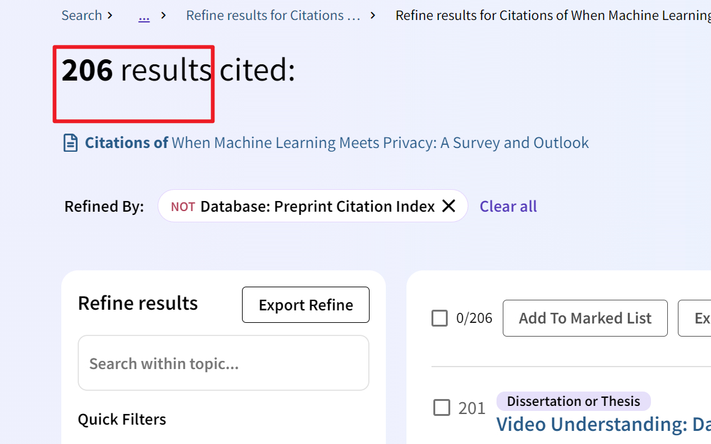

# 1. 说明

论文的引用查找

# 2. 使用方法

在 Ref.docx 中放入格式正确的参考文献格式

或者自定义 Get_title.py 文件，使得 main 文件接收一个包含文章题目的 list，在 main 中定义为 NeedFind_PaperTitle

## 2.1. main_1.py

该文件用于生成初步的参考查询地址，运行状态如下：

结果存放在 Data.xlsx 中：

### 2.1.1. 假引用

页面显示的引用数目

### 2.1.2. 真引用

实际能查到的引用数目

## 2.2. main_2.py 和 main_3.py

main_2.py 用于进一步查找每个引文的数据，建议自行更改为待查询内容，这一步有点久，即使已进行了并行计算的处理，结果存放在 Ref_index_search.xlsx

查询有时候会出错，因为有些文献可能展示的数据格式不统一，具体可以直接查询该文章，观察结构究竟差异在哪里：

main_3.py 就是为 main_2.py 的报错的文献部分进行进一步修正用的，不一定能全部修好

最终的查询结果如下，在 Ref_index_search_fin.xlsx 中：

